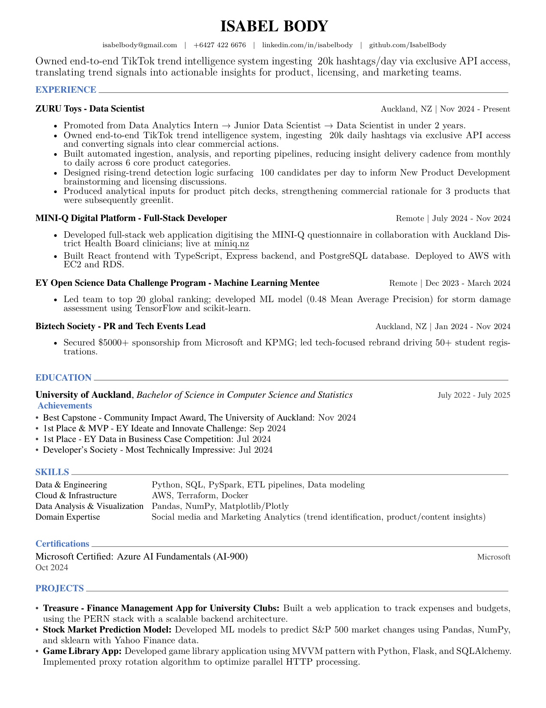

# Isabel Body - Resume



> **[Download Resume PDF](IsabelBodyResume.pdf)**

---

## Quick Access

The compiled resume PDF is available directly in this repository:
- **[IsabelBodyResume.pdf](IsabelBodyResume.pdf)** - Full resume in PDF format
- **IsabelBodyResume.jpg** - Preview image (automatically generated during compilation)

## About This Resume

This is my professional resume built with LaTeX for a clean, professional presentation. The modular structure allows me to easily maintain and update different sections (experience, education, skills, projects, certifications, achievements, languages) without touching the core document structure.

The resume is compiled from LaTeX source files using a custom class file and outputs a polished PDF suitable for job applications and professional networking.

### Repository Structure

```
resume/
├── IsabelBodyResume.pdf          # Compiled resume PDF (for recruiters/HR)
├── IsabelBodyResume.jpg          # Preview image (auto-generated)
├── README.md                      # This file
├── compile_resume.py              # Build script for automated compilation
├── requirements.txt               # Python dependencies (for PDF→JPG conversion)
└── src/                           # LaTeX source files
    ├── resume.tex                 # Main LaTeX document (entry point)
    ├── resume.cls                 # Custom LaTeX class file (defines styling)
    ├── cv/                        # Modular content sections
    │   ├── summary.tex            # Professional summary
    │   ├── experience.tex         # Work experience (ZURU Toys, MINI-Q, etc.)
    │   ├── education.tex          # Education background
    │   ├── skills.tex             # Technical skills
    │   ├── projects.tex           # Project portfolio
    │   ├── Certifications.tex     # Professional certifications
    │   ├── achievements.tex       # Notable achievements
    │   └── languages.tex          # Language proficiencies
    └── fonts/                     # Font files (Roboto family + FontAwesome)
```

### Compiling the Resume

To compile the resume from source to PDF, run from the repository root:

```bash
python compile_resume.py
```

This script will:
1. Check for XeLaTeX installation
2. Compile `src/resume.tex` to PDF (two passes for proper references)
3. Generate `IsabelBodyResume.pdf` in the root directory
4. Automatically create a JPG preview image (`IsabelBodyResume.jpg`)

**Requirements:**
- **XeLaTeX** - Required for proper font rendering (install via [MiKTeX](https://miktex.org/download) or [TeX Live](https://www.tug.org/texlive/))
- **Python 3** - For running the compilation script
- **Optional dependencies** (for JPG preview generation):
  - `PyMuPDF` and `Pillow` (recommended, install via `pip install -r requirements.txt`)
  - Or `pdf2image` with poppler-utils
  - Or ImageMagick

**Compilation options:**
- `python compile_resume.py --force-clean` - Clean auxiliary files before compilation (recommended when class file changes)
- `python compile_resume.py --clean` - Clean auxiliary files after successful compilation

### Making Updates

To update resume content, edit the relevant `.tex` files in `src/cv/`. The modular structure makes it easy to:
- Add new experiences, projects, or achievements
- Update skills or certifications
- Modify the professional summary
- Adjust section ordering in `src/resume.tex`

After making changes, recompile using `compile_resume.py` to generate an updated PDF.
